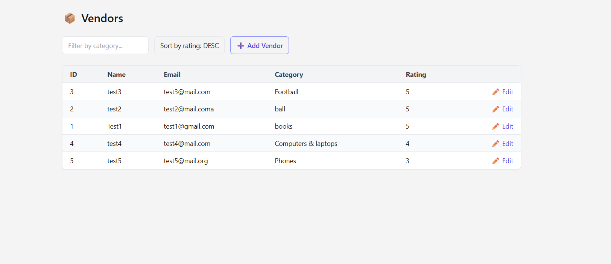
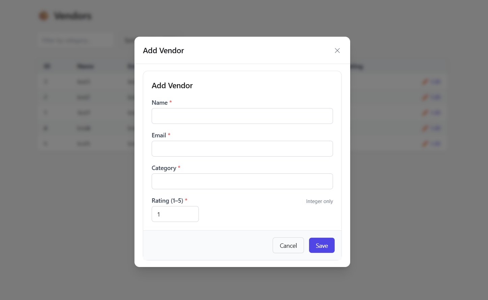
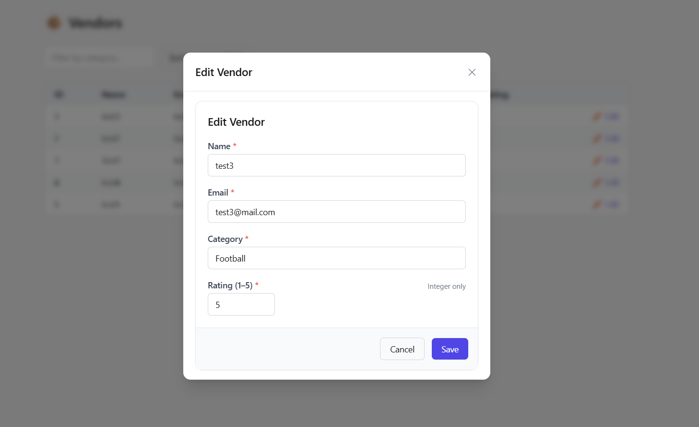

# 📦 Vendor Manager (FastAPI + React + Tailwind)

A clean, production‑style mini CRM application for managing **Vendors**.
Built as a compact, well‑structured full‑stack feature.

---

## ✨ Stack

| Layer | Technology |
|------|------------|
| Frontend | React + TypeScript + Vite + TailwindCSS |
| Backend | FastAPI + Pydantic v2 + SQLAlchemy |
| Database | SQLite (easily replaceable with Postgres) |
| UI | TailwindCSS + Modal animation + Toast notifications |
| Tests | Pytest + TestClient (in‑memory DB) |

---

## 🎯 Features

- View vendors list
- Create new vendor
- Edit existing vendor
- Email validation + Rating validation (1–5)
- Filter by category
- Sort by rating
- Animated center modal with backdrop blur
- Toast notifications (success / error)
- Automated API tests

---

## 🖥️ Screenshots


```
/screenshots/
  vendors-list.png
  add-vendor-modal.png
  edit-vendor-modal.png
```

### Vendors List


### Add Vendor (Modal)


### Edit Vendor (Modal)


---

## 🚀 Running the Project

### Backend
```bash
cd backend
python -m venv env
# Windows
env\\Scripts\\activate
# Mac/Linux
# source env/bin/activate

pip install -r requirements.txt
uvicorn app.main:app --reload --port 8000
```

API runs at:
```
http://localhost:8000/api/vendors
```

### Frontend
```bash
cd frontend
npm install
npm run dev
```

UI runs at:
```
http://localhost:5173
```

---

## ✅ Running Tests
```bash
cd backend
pytest -q
```
Expected:
```
5 passed in 1.x seconds
```

---

## 📂 Project Structure
```
vendor-manager/
│
├── backend/
│   ├── app/
│   │   ├── main.py          # API routes
│   │   ├── models.py        # DB models (SQLAlchemy)
│   │   ├── schemas.py       # Pydantic v2 models
│   │   └── db.py            # DB session
│   └── tests/test_api.py    # API tests
│
└── frontend/
    ├── src/
    │   ├── pages/VendorsPage.tsx
    │   ├── components/
    │   │   ├── VendorForm.tsx
    │   │   ├── VendorTable.tsx
    │   │   ├── Modal.tsx
    │   │   └── Toast.tsx
    │   └── api/client.ts
```

---

## 🌍 Possible Enhancements
- Authentication (JWT / OAuth)
- PostgreSQL + Alembic migrations
- Pagination + search bar
- Docker Compose deployment
- CI pipeline (lint + test)

---

## 🤝 Author
**Zikrullo Amiri**

If you like this project — ⭐ star it on GitHub!

